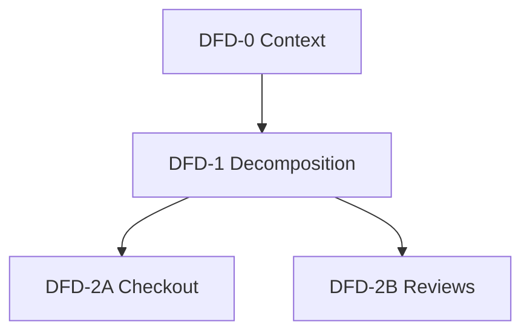

# ListoPad: дорожня карта та життєвий цикл розробки

## 1. Призначення документа

Цей документ описує не лише послідовність технічних кроків, а й логіку інженерних рішень, які поступово перетворили `ListoPad` із базового навчального проєкту на повноцінну full-stack систему з ознаками реального e-commerce продукту.

## 2. Повний стек розробки

У фронтенд-частині за основу було взято `React 19` у парі з `TypeScript` та `Vite`. Такий вибір забезпечив швидку ітерацію інтерфейсів, контроль типів і достатню гнучкість для поступового ускладнення клієнтської логіки. Для маршрутизації використовувався `react-router-dom`, а для візуалізації аналітичних показників у CRM-модулі — `recharts`.

Серверна частина реалізована на `Django 5.2` та `Django REST Framework`, з JWT-аутентифікацією через `djangorestframework-simplejwt`. Ключовою архітектурною особливістю стало винесення бізнес-логіки в доменні модулі (`backend/domain/*`), що дозволило тримати контролери «тонкими», а правила предметної області — централізованими і тестованими.

Як основну СУБД обрано `MongoDB` через офіційний `django-mongodb-backend`, при цьому проєкт зберіг сумісність із `PostgreSQL` і `SQLite` для окремих локальних чи CI-сценаріїв. У площині якості застосовано багаторівневу перевірку: backend-тести (`python manage.py test`), frontend unit/integration (`vitest`), end-to-end тести (`Playwright`) і обов’язкову перевірку збірки.

Окремим інженерним шаром виступили артефакти системного аналізу: DFD-діаграми у Canvas і синхронізована Mermaid-версія для документування.

## 3. Етапи життєвого циклу

## Етап 1. Архітектурний фундамент і кероване середовище

Початковий етап був зосереджений не на UI-ефектах, а на стабільності середовища виконання. Базова ідея полягала в тому, щоб із самого старту уникнути «жорсткої прив’язки» до однієї БД і дати проєкту контрольовану конфігурацію для різних режимів запуску.

```python
# backend/settings.py
if DB_ENGINE == 'postgres':
    DATABASES = {'default': {'ENGINE': 'django.db.backends.postgresql', ...}}
elif USE_MONGO_DB:
    DATABASES = {'default': {'ENGINE': 'django_mongodb_backend', ...}}
elif DB_ENGINE == 'sqlite':
    DATABASES = {'default': {'ENGINE': 'django.db.backends.sqlite3', ...}}
else:
    raise ImproperlyConfigured(...)
```

Це рішення дало два практичні ефекти: по-перше, локальна розробка не блокується через інфраструктурні обмеження; по-друге, вся подальша еволюція доменної моделі відбувається в передбачуваному конфігураційному контурі.

## Етап 2. Єдиний API-шар і сесійна витривалість

Після стабілізації середовища ключовим стало питання комунікації між клієнтом і сервером. Було реалізовано централізований API-клієнт із єдиною політикою обробки помилок, ретраїв і токен-ротації. Це принципово важливо для систем, у яких частина сценаріїв має багатокрокову взаємодію з API.

```ts
// services/api.ts
if (res.status === 401 && retry && tokenStore.refresh) {
  try {
    await apiService.refreshToken();
    return request<T>(path, init, false);
  } catch {
    tokenStore.clear();
    throw new ApiError({ detail: 'Сесію завершено. Увійдіть повторно.', code: 401 });
  }
}
```

У практичному вимірі це прибрало дублювання коду в компонентах і зробило поведінку клієнта прогнозованою навіть при нестабільній мережі або протуханні access-токена.

## Етап 3. Каталог, контент і стабільність медіа

Третій етап стосувався якості предметних даних і надійності відображення каталогу. Було розширено модель книги, нормалізовано поля карток і забезпечено захист інтерфейсу від пошкоджених зовнішніх обкладинок.

```python
# backend/serializers.py
def get_coverImage(self, obj):
    cover_url = (obj.cover_image or '').strip()
    if cover_url.startswith(('http://', 'https://', 'data:image/')):
        return cover_url
    return DEFAULT_COVER_IMAGE
```

Такий fallback-механізм має не косметичний, а операційний сенс: каталог залишається цілісним у візуальному плані, а сторінки товарів не втрачають структуру через сторонні збої.

## Етап 4. Checkout-домен: ідемпотентність та атомарність

Коли базовий каталог і API-контур стали стабільними, фокус перейшов на ризикову бізнес-операцію — оформлення замовлення. Тут було реалізовано ідемпотентний контроль і транзакційний характер checkout.

```python
# backend/domain/orders.py
normalized_key = (idempotency_key or '').strip()
if not normalized_key:
    raise OrderDomainError('Відсутній Idempotency-Key для checkout.', status_code=400)

existing = Order.objects.filter(idempotency_key=normalized_key).first()
if existing:
    return existing
```

Це рішення критично важливе в реальній експлуатації: повторний submit, повторний клік або повторний HTTP-запит не створюють дубльовані замовлення і не розвалюють складську консистентність.

## Етап 5. Промокоди і прозорий розрахунок підсумків

Наступним кроком стала економічна логіка оформлення. Було додано гнучкі правила промокодів і окремий preview-розрахунок, який дає користувачу фінальний кошторис до створення замовлення.

```python
# backend/domain/orders.py
promo, discount_amount = _resolve_discount(
    promo_code=(promo_code or '').strip().upper(),
    subtotal_amount=subtotal_amount,
    user=user,
)
total_amount = max(Decimal('0.00'), subtotal_amount + shipping_amount - discount_amount)
```

Суттєвий нюанс полягає в тому, що валідація промо-правил зосереджена в домені. Це унеможливлює розсинхрон між фронтендом і бекендом у фінансово чутливих сценаріях.

## Етап 6. Операційна адмінка і контроль статусного графа

Після стабілізації оформлення замовлень система отримала розширений операційний контур для адміністратора: фільтри, таймлайн статусів, пошук і керування переходами між станами.

```tsx
// components/AdminOrders.tsx
const getNextStatuses = (status: OrderStatus): OrderStatus[] => {
  const map: Record<OrderStatus, OrderStatus[]> = {
    ordered: ['paid', 'cancelled'],
    paid: ['packed', 'cancelled'],
    packed: ['shipped', 'cancelled'],
    shipped: ['delivered'],
    delivered: ['closed'],
    closed: [],
    cancelled: [],
    shipping: ['delivered'],
    at_branch: ['closed'],
    received: [],
  };
  return map[status] || [];
};
```

Ідея цього етапу — не дати оператору виконати «логічно неможливу» дію. Інтерфейс обмежує кроки до дозволених, а backend підтверджує правила на рівні доменної валідації.

## Етап 7. Відгуки, модерація і довіра до рейтингу

Окремим напрямом стала репутаційна складова продукту. Було реалізовано повний цикл `submit -> moderation -> public`, де користувач створює відгук, адміністратор модерує, а публічна частина відображає лише підтверджені записи.

```python
# backend/views.py
@action(detail=True, methods=['get', 'post'], url_path='reviews')
def reviews(self, request, pk=None):
    book = self.get_object()
    if request.method.upper() == 'GET':
        rows = BookReview.objects.filter(book=book, status=BookReview.Status.APPROVED)
        return Response(BookReviewPublicSerializer(rows, many=True).data)
    review, _ = BookReview.objects.update_or_create(
        book=book,
        user=request.user,
        defaults={'rating': payload['rating'], 'comment': payload['comment'].strip(), 'status': BookReview.Status.PENDING},
    )
```

Ключовий результат цього етапу полягає в тому, що рейтинг книги спирається на модераційно підтверджений контент, а не на будь-який сирий ввід.

## Етап 8. UX-полірування і зменшення когнітивного шуму

Після функціонального завершення критичних бізнес-флоу було виконано серію UX-ітерацій: зменшення візуального перевантаження фільтрів, покращення контрасту, масштабування типографіки і контрольних елементів.

```tsx
// components/StorefrontFilters.tsx
const [showAdvanced, setShowAdvanced] = useState(false);
...
<button type="button" onClick={() => setShowAdvanced((prev) => !prev)}>
  {showAdvanced ? 'Сховати фільтри' : 'Показати фільтри'}
</button>
{showAdvanced && <div className="mt-3 pt-3 border-t">...</div>}
```

Сутність цього етапу — віддати пріоритет контенту. Користувач повинен бачити книги і рішення про покупку, а не громіздкий блок керування.

## Етап 9. Живе демо-середовище для захисту

Щоб система виглядала не як прототип, а як діючий продукт, було створено автоматизований сценарій «живого» сидінгу: демо-користувачі, замовлення з різними статусами, модераційні відгуки, wishlist та промо-активність.

```python
# backend/management/commands/seed_demo_activity.py
for idx in range(total_orders):
    buyer = buyers[idx % len(buyers)]
    ...
    order = create_checkout_order(...)
    target_status = status_pool[idx % len(status_pool)]
    order = _progress_status(order, target_status, admin_user)
```

Цей етап принциповий для презентації: аналітика, профілі й операційні модулі відображають реальні зв’язки даних, а не порожні екрани.

## Етап 10. Системний аналіз і DFD-артефакти

Фінальний етап зафіксував архітектуру у вигляді DFD-пакета двома синхронними каналами: візуальні схеми в Canvas та Mermaid-версія для документації.



Така двоканальна подача важлива для академічного контексту: комісія бачить структурну картину системи, а технічна частина отримує переносимий і версіонований текстовий формат.

## 4. Підсумок життєвого циклу

У підсумку `ListoPad` пройшов повний інженерний цикл: від конфігураційної бази й API-контракту до зрілого доменного шару, контрольованої адміністративної операційки, модерації контенту, живого демо-ландшафту даних та завершеного набору системно-аналітичних артефактів. Саме ця послідовність робіт, а не окремі фічі, формує проєкт як цілісну інженерну систему, придатну до публічного технічного захисту.
