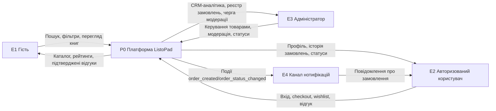
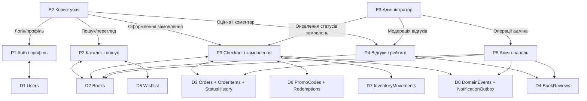
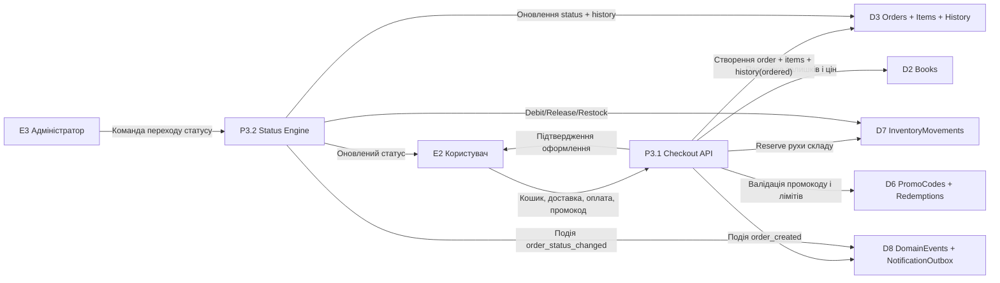
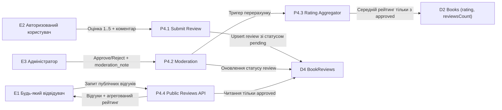

# ListoPad — Data Flow Diagrams (DFD)

## Нотація

- `E*` — зовнішня сутність (External Entity)
- `P*` — процес (Process)
- `D*` — сховище даних (Data Store)

## DFD-0 (Context Diagram)

## DFD-1 (System Decomposition)

## DFD-2A (Checkout та життєвий цикл замовлення, деталізація P3)

## DFD-2B (Відгуки, модерація, рейтинг, деталізація P4)

